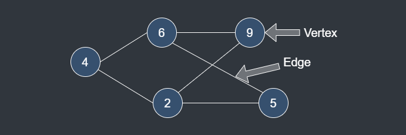

# Graph

## Description

Graph is a data structure which is consisted of 'Vertex' and 'Edge'.

It is an organization chart among vertexes.

### Vertex

Vertex is a location like node in graph.

### Edge

Edge is a relation between vertexes.

## Time Complexity(Adjacency Metrix Graph)

| Operation                       | Best | Worst |
|---------------------------------|------|-------|
| Insert                          | O(1) | O(1)  |
| Delete                          | O(1) | O(1)  |
| Search(Two Nodes)               | O(1) | O(1)  |
| Search(All Nodes from One Node) | O(n) | O(n)  |
