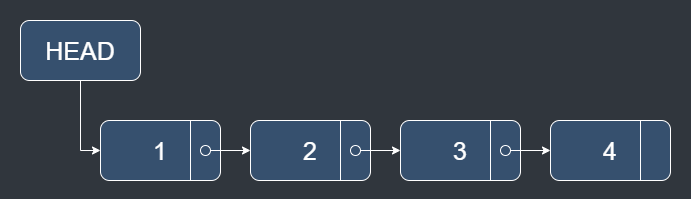

# Linked List

## Description

Linked list is a linear collection of data structure.

Each node has datas and a pointer which point out next node.

Unlike the array, the linked list can insert and delete the data in the middle.

## Time Complexity

| Operation | Best | Worst |
|-----------|------|-------|
| Insert    | O(1) | O(1)  |
| Delete    | O(1) | O(1)  |
| Search    | O(n) | O(n)  |

