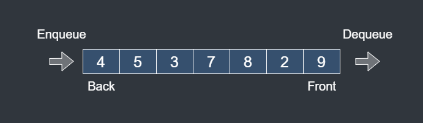
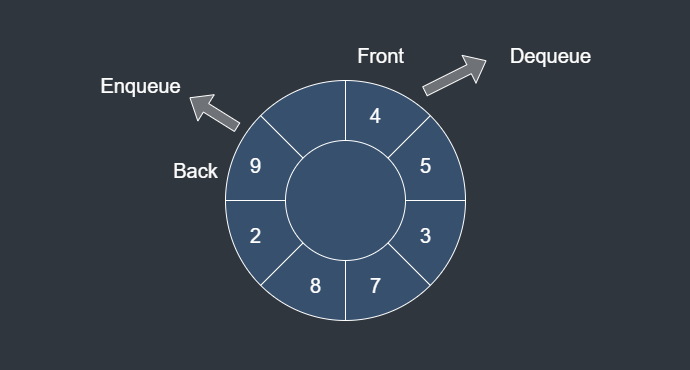

# Queue

## Description

Queue is maintained data structure of computer.

Queue is a **First-In-First-Out(FIFO)** data structure. The first data added to the queue will be first one to be remove.

**Enqueue** means add a new data to queue.

**Dequeue** means remove a front data from queue.

### Linear Queue

Linear queue is easy to implement, but memory is wasted.

### Circular Queue

Circular queue overcame linear queue's weakness. Circular queue has no memory waste.

## Time Complexity

| Operation | Best | Worst |
|-----------|------|-------|
| Insert    | O(1) | O(1)  |
| Delete    | O(1) | O(1)  |
| Search    | O(n) | O(n)  |

