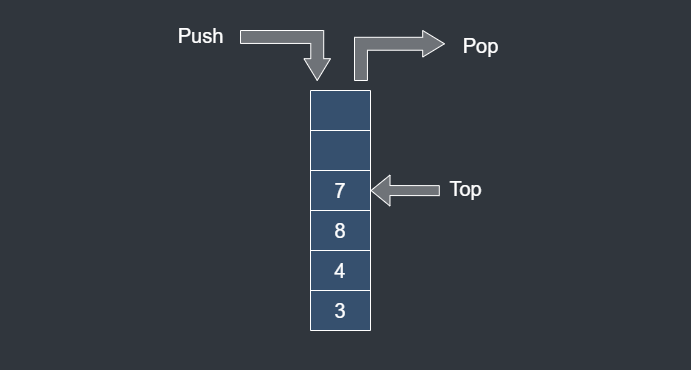

# Stack

## Description

Stack is maintained data structure of computer.

Stack is a **Last-In-First-Out(LIFO)** data structure. The first data added to the stack will be last one to be remove.

**Push** means add a new data to stack.

**Pop** means remove a last data from stack.

## Time Complexity

| Operation | Best | Worst |
|-----------|------|-------|
| Insert    | O(1) | O(1)  |
| Delete    | O(1) | O(1)  |
| Search    | O(n) | O(n)  |

