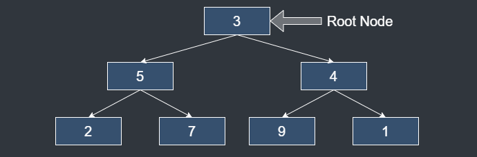

# Tree

## Description

Tree is a type of graph. Multiple nodes cannot point to one node.

It is called "tree" because it looks similar to a tree when visualized.

It is one of the efficient data structures for search.

### Pre Order
1. Visit node.
2. Pre-order left sub tree.
3. Pre-order right sub tree.

### In Order
1. In-order left sub tree.
2. Visit node.
3. In-order right sub tree.

### Post Order
1. Post-order left sub tree.
2. Visit node.
3. Post-order right sub tree.

## Time Complexity(Binary Search Tree)

| Operation | Best     | Worst |
|-----------|----------|-------|
| Insert    | O(log n) | O(n)  |
| Delete    | O(log n) | O(n)  |
| Search    | O(log n) | O(n)  |
