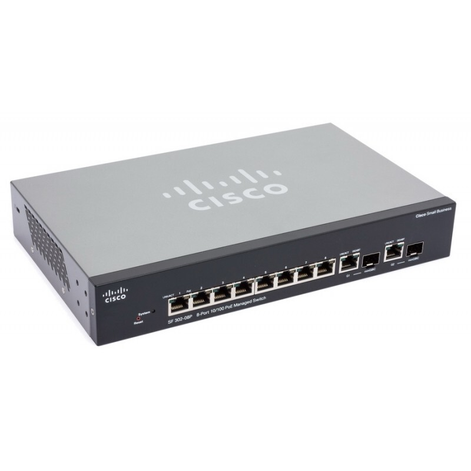
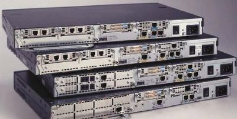

# OSI 7 Layers

## What is OSI 7 Layers?

> Open Systems Interconnection

OSI 7 Layers(a.k.a. OSI Model) describes seven layers that computer systems use to communicate over a network.

Each Layers use only lower tier layer's functions, and provide functions to upper tier layer.

| Layer   | Name               |
|---------|--------------------|
| 7 Layer | Application Layer  |
| 6 Layer | Presentation Layer |
| 5 Layer | Session Layer      |
| 4 Layer | Transport Layer    |
| 3 Layer | Network Layer      |
| 2 Layer | DataLink Layer     |
| 1 Layer | Physics Layer      |

## Layers

### Physics Layer

Physics layer is responsible for physics connection in network. It consists of network hardware transport technology.

### DataLink Layer

Data link layer is responsible for connecting between peripherals on the network using physics layer.

1. **Allocate Address** : Allocate many signals on the network's device from physics layer.
2. **Detect Error** : Detect error while signals being delivered.

This is a `Bridge`. It is typical equipment of data link layer. `L2 Switch` is other equipment of data link layer.

### Network Layer

Network layer is responsible for *packet forwarding* include routing.

**What is _packet forwarding_?**

Packet forwarding is a step to send a packet to finally network using input packet's header information.

IPv4, PIv6 are typical protocol of network layer.

This is typical equipment of network layer.

## Transport Layer

Transport layer os responsible for providing communication service to connect sender and receiver

Transport layer provides reliability, flow control.

TCP(Transmission Control Protocol) and UDP(User Datagram Protocol) are typical protocol of transport layer.

## Session Layer

Session layer is responsible for establishing, maintaining, synchronizing, terminating sessions between end-user applications.

Session layer provides authentication and permission to session connect.

H.245, NetBIOS, RPC are typical protocol of session layer.

## Presentation Layer

Presentation layer is responsible a data translator in network.

It provides data translate, data compression, encryption, and decryption.

SSL(Secure Socket Layer) is a typical protocol of presentation layer.

## Application Layer

Application layer is an abstract layer for connection between process which through network.

Many protocols are included application layer.

For example, SSH, HTTP, SMTP are application layer's typical protocol.