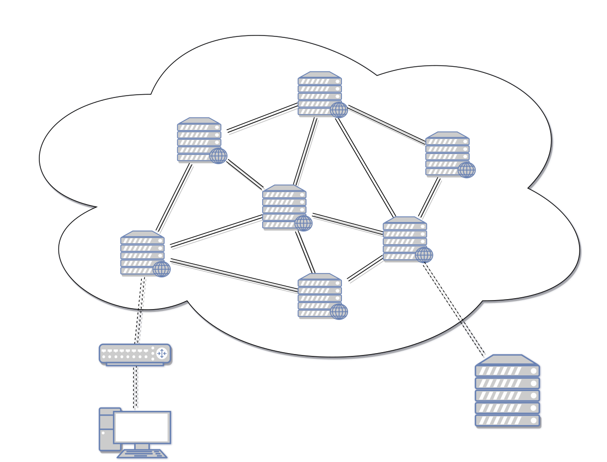

# Routing

Routing is the process of selecting a path for traffic a network or across multiple networks.

The best of path if the shortest distance or the least amount of time.

Router is a device to conduct routing.

Router makes the best of path using 'Routing Protocol', and save at 'Routing Table'.

## Delivery schemes

There are 4 routing schemes:
1. Unicast : **One to One**
2. Broadcast : **One to All**
3. Multicast : **One to Many** or **Many to Many**
4. Anycast : **One to One of Many**