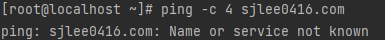
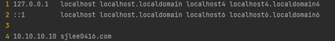
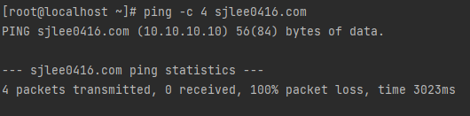

# DNS vs IP in Linux PC

> Linux PC에서 DNS 결과값보다 우선시하여 특정 도메인에 대한 IP 설정이 가능한가?

## 1. Before

```shell
ping -c 4 sjlee0416.com
```



Cannot found sjlee0416.com's IP address.

## 2. Edit `hosts` file

```shell
vi /etc/hosts
```



Add `10.10.10.10 sjlee0416.com`.

## 3. After

```shell
ping -c 4 sjlee0416.com
```



PING try to send packet to `10.10.10.10`.