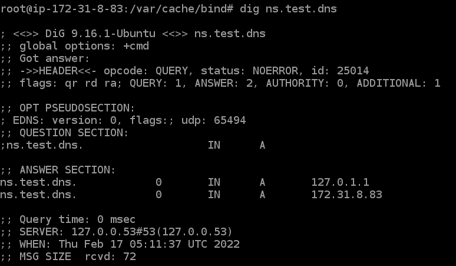

# EC2 bind9

> 실제 EC2 서버에 bind9을 설치하고 DNS 서버 구성

## OS

Ubuntu 20.04

## Installing and Setting DNS Server

### Install bind9

```shell
# DNS Server

sudo su
apt update -y
apt upgrade -y
apt install -y bind*
```

### Edit `/etc/hosts`

```shell
# DNS Server

vi /etc/hosts
```

```editorconfig
127.0.0.1 localhost
127.0.1.1 ns.test.dns
172.31.8.83 ns.test.dns

# The following lines are desirable for IPv6 capable hosts
::1 ip6-localhost ip6-loopback
fe00::0 ip6-localnet
ff00::0 ip6-mcastprefix
ff02::1 ip6-allnodes
ff02::2 ip6-allrouters
ff02::3 ip6-allhosts
```

### Edit `/etc/hostname`

```shell
# DNS Server

vi /etc/hostname
```

```editorconfig
ns.test.dns
```

### Edit `/etc/bind/named.conf.options`

```shell
vi /etc/bind/named.conf.options
```

```editorconfig
options {
	directory "/var/cache/bind";
	dnssec-validation auto;
	auth-nxdomain no;
    listen-on port 53 { localhost; 172.31.0.0; };
    allow-query { any; };
    forwarders { 8.8.8.8; };
    recursion yes;
};
```

### Edit `/etc/bind/named.conf.local`

```shell
vi /etc/bind/named.conf.local
```

```editorconfig
zone "test.dns" IN {
type master;
file "test.dns.zone";
};

zone "0.31.172.in-addr-arpa" IN {
type master;
file "test.dns.zone.rev";
};
```

### Edit `/var/cache/bind/test.dns.zone`

```shell
vi /var/cache/bind/test.dns.zone
```

```editorconfig
$TTL    86400
@       IN      SOA     ns.test.dns.    root.ns.test.dns.(
                                        1
                                        604800
                                        86400
                                        2419200
                                        86400 )
@       IN      NS      ns.test.dns.
ns      IN      A       172.31.8.83
```

### Edit `/var/cache/bind/test.dns.zone.rev`

```shell
vi /var/cache/bind/test.dns.zone.rev
```

```editorconfig
$TTL    86400
@       IN      SOA     ns.test.dns.    root.ns.test.dns.(
2
604800
86400
2419200
86400 )
@       IN      NS      ns.
83      IN      PTR     ns.test.dns.
```

### Restart bind9

```shell
systemctl restart bind9
```

## Testing using `nslookup` and `dig`

### nslookup

```shell
nslookup ns.test.dns
```


### dig

```shell
dig ns.test.dns
```


