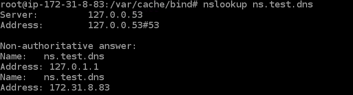

# EC2 bind9

> 실제 EC2 서버에 bind9을 설치하고 DNS 서버 구성

## Architecture



## Installing and Setting DNS Server

### Install bind9

```shell
# DNS Server

sudo yum update -y
sudo yum install -y bind*
```

### Edit `/etc/resolv.conf`

```shell
# DNS Server

sudo vi /etc/resolv.conf
```

```editorconfig
; generated by /usr/sbin/dhclient-script
search ap-northeast-1.compute.internal
options timeout:2 attempts:5
nameserver 172.31.0.2
nameserver 127.0.0.1 ; HERE
```

### Edit '/etc/named.conf'

```shell
# DNS Server

sudo vi /etc/named.conf
```

```
options {
        listen-on port 53 { any; };
        listen-on-v6 port 53 { any; };
        directory       "/var/named";
        dump-file       "/var/named/data/cache_dump.db";
        statistics-file "/var/named/data/named_stats.txt";
        memstatistics-file "/var/named/data/named_mem_stats.txt";
        recursing-file  "/var/named/data/named.recursing";
        secroots-file   "/var/named/data/named.secroots";
        allow-query     { any; };
        
        recursion yes;

        dnssec-enable yes;
        dnssec-validation yes;

        bindkeys-file "/etc/named.root.key";

        managed-keys-directory "/var/named/dynamic";

        pid-file "/run/named/named.pid";
        session-keyfile "/run/named/session.key";
};

logging {
        channel default_debug {
                file "data/named.run";
                severity dynamic;
        };
};

zone "." IN {
        type hint;
        file "named.ca";
};

zone "test.com" IN {
        type master;
        file "named.test.com";
        allow-update { none; };
};

include "/etc/named.rfc1912.zones";
include "/etc/named.root.key";
```

### Create new file in `/var/named.test.com`

```shell
# DNS Server

sudo cp /var/named/named.empty /var/named/named.test.com
sudo vi /var/named/named.test.com
```

```editorconfig
$TTL 1M
@       IN SOA  @ ns.test.com. (
                                        0       ; serial
                                        1D      ; refresh
                                        1H      ; retry
                                        1W      ; expire
                                        3H )    ; minimum
        NS      @ ns.test.com
        A       172.31.11.98    ; Web Server IP

```

### Restart bind9

```shell
sudo systemctl start named
sudo systemctl status named
```

## Installing and Setting Web Server

### Install Web Server

```shell
# Web Server

sudo yum update -y
sudo yum install -y httpd
```

### Create a New `index.html` in Web Server

```shell
sudo vi /var/www/html/index.html
```

Write something in index.html.

```html
Apache Web Server
```

### Start Apache Web Server

```shell
sudo systemctl start httpd
sudo systemctl enable httpd
sudo systemctl status httpd
```

## Setting Client

```shell
sudo vi /etc/sysconfig/network-scripts/ifcfg-eth0
```

```
DEVICE=eth0
BOOTPROTO=dhcp
ONBOOT=yes
TYPE=Ethernet
USERCTL=yes
PEERDNS=yes
DHCPV6C=yes
DHCPV6C_OPTIONS=-nw
PERSISTENT_DHCLIENT=yes
RES_OPTIONS="timeout:2 attempts:5"
DHCP_ARP_CHECK=no
DNS1=172.31.44.46
```

Then reboot client EC2.

```shell
sudo shutdown -r now
```