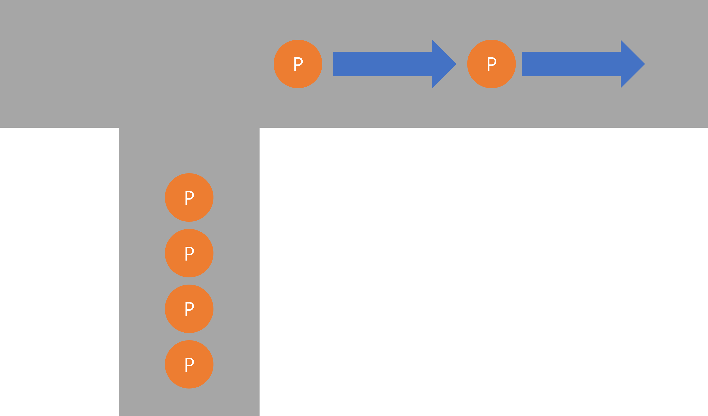
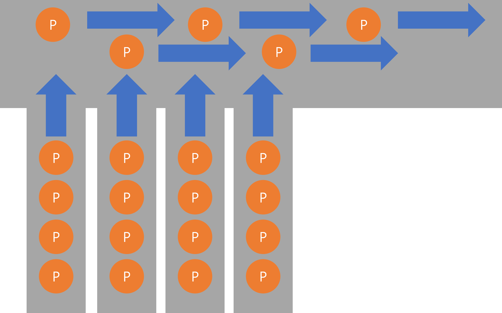

# Hub vs Switch

> 허브를 통해서 각 PC를 연결하는 것과 스위치를 통해 각 PC를 연결하는 것의 성능 차이

## Hub

Only one port can communicate at a time.

## Switch

Each port can communicate independent.

## Result

Switch's performance is better than hub.