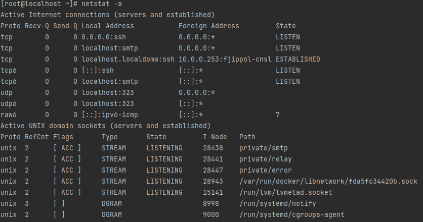

# TCP and Linux Network Socket

> TCP 환경에서 데이터 전달 과정
> 
> 리눅스에서 각 네트워크 소켓의 상태

## TCP

### Connection Establish

A client may establish a connection by initiating an active open using 3-step handshake.

[What is 3-step handshake?](TCP-3-STEP.md)

### Data Transfer

A Process transfer `Segment` to other process. The segment has a sequence number and data. 

### Connection Termination

The connection termination phase uses a 4-step handshake, with each side of the connection terminating independently.

4-step handshake is used FIN and ACK.

### Socket in Linux

```shell
netstat
```

You can use `netstat` command for monitoring sockets' status.

If netstat command not found, please install `net-tools` using package manager.

```shell
yum install -y net-tools
```


