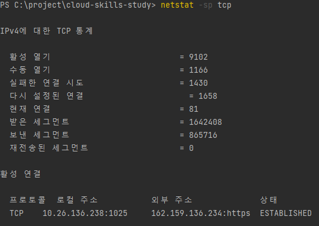
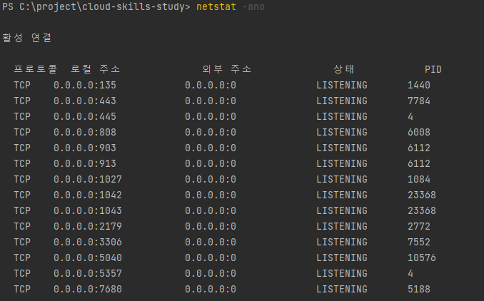
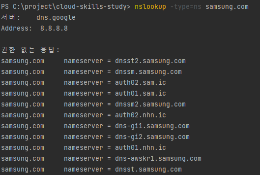
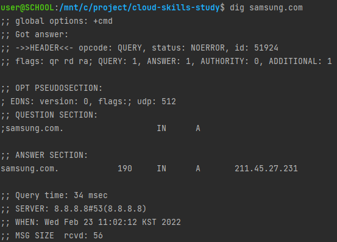
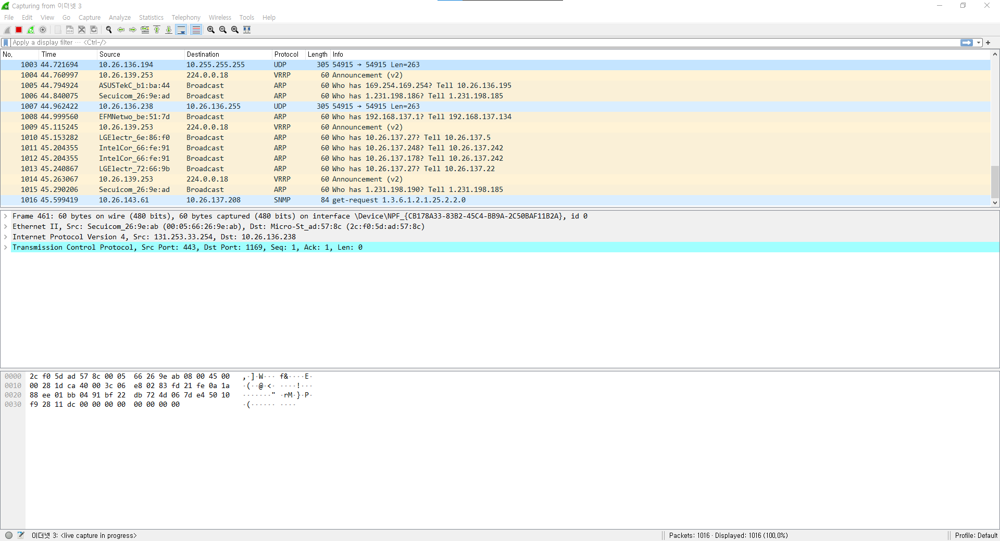

# Network Troubleshooting

> 네트워크 트러블슈팅에 사용 가능한 툴과 사용법, 예제

## Commands

### `netstat`

`netstat -sp tcp`

`netstat -ano`

### `nslookup`

`nslookup -type=ns samsung.com`

### `dig`

`dig samsung.com`

## Tools

### Wireshark

